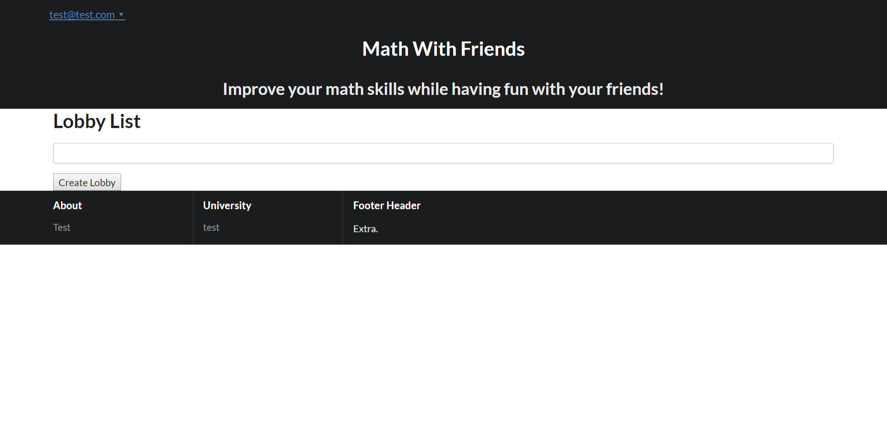
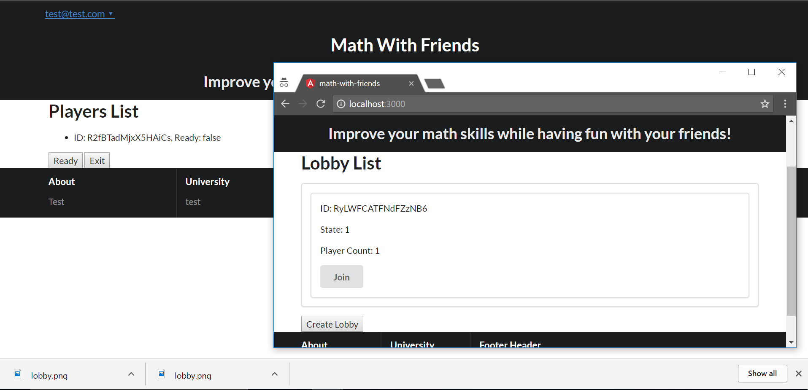
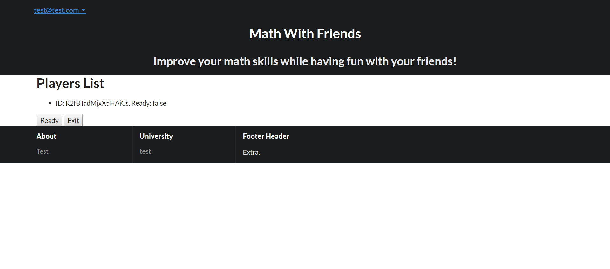
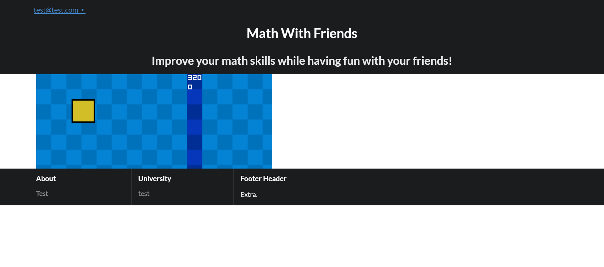
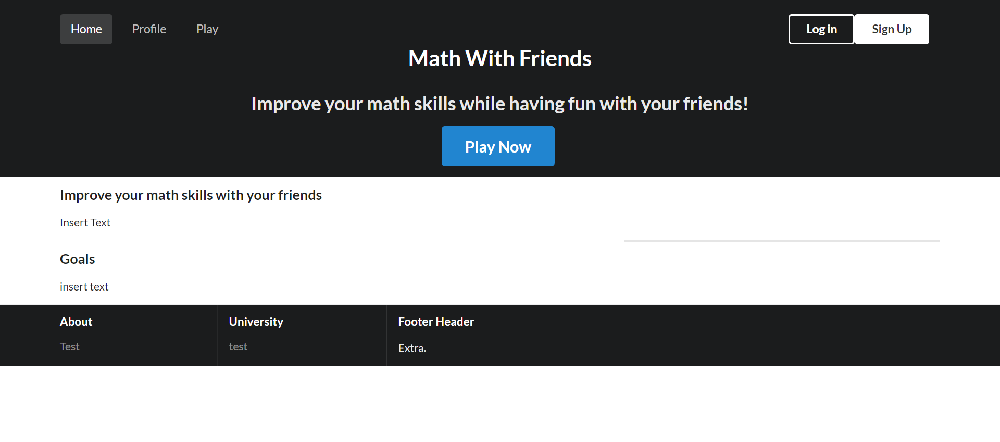
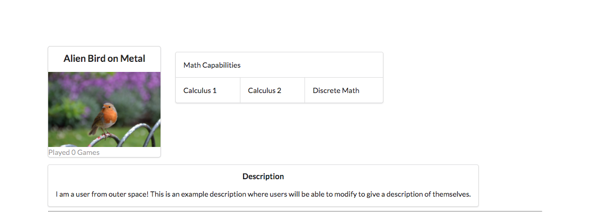

# Table of Contents

* [About](#about)
* [Installation](#installation)
* [Application Design](#application-design)
* [Development History](#development-history)
* [Contact Us](#contact-us)

# About

Math With Friends is an online game that makes learning math fun for students.
Check out the github repository [here](https://github.com/math-with-friends/math-with-friends/).

Players can join or create a lobby, which is a temporary place for players to gather before they start the game.





This is the lobby, which lists the players currently joined. When all of the players press ready, the game starts.



Players can play the acutal game in real-time.



Landing page:



Profile page:



## Main Idea

Players can fly across the map simultaneously, while passing through quiz problems which we will call "checkpoints" for convenience. At each checkpoint, there are two distinct areas on the screen through which the players have to pass, each area indicating "yes" or "no". At the top of the screen, there will be a simple math statement, and the yes or no areas indicate the truth value of the statement. The players have to pass through the correct area, or else they'll lose the game. At the end of the map, there is a finishing line. The goal of this game is to reach the finishing line as quickly as possible, while correctly answering the math questions along the way.


# Installation

First, [install Meteor](https://www.meteor.com/install).

Second, [download a copy of Math With Friends](https://github.com/math-with-friends/math-with-friends/), or clone it using git.
  
Third, cd into the app/ directory and install libraries with:

```
$ meteor npm install
```

Fourth, run the system with:

```
$ meteor run
```

# Application Design

## Directory Structure

```
client/
  lib/           # Holds Semantic UI files.
  head.html      # The <head>.
  main.js        # Import all the client-side html and js files.
  main.less      # Global styling.

imports/
  api/           # Defines data processing code (server side).
    game/
    lobby/
  startup/       # Defines code to run when system starts up (client-only, server-only).
    client/        
    server/        
  ui/
    components/  # Templates that appear inside a page template.
    layouts/     # Layouts contain common elements to all pages (i.e. menubar and footer).
    pages/       # Pages are navigated to by FlowRouter routes.
    stylesheets/ # CSS customizations, if any.

node_modules/    # managed by Meteor

public/          
  images/        # Holds static images for landing page and predefined sample users.
  
server/
   main.js       # Import all the server-side js files.
```

## Separation of Concerns

We believe that drawing a clear line between client side and server side code is important in increasing the maintainability of the code. As a general rule of thumb, most of the server side code will reside in imports/api while most of the client side code will reside in imports/ui. The server processes the data while the client simply renders it. 

## Efficient Real-Time Communication 

An integral component in a multiplayer game is reactivity and the spontaneity of other players' actions. To accomplish this, first we considered a naive approach- if we keep the application data in database collections and publish them, then Meteor's native, reactivity magic will provide the players access to real-time data. The problem with this approach is that we have a constraint. Because our database is hosted on MLAB, the speed at which database queries are made will be limited and using slow responses to accomplish real-time communication will be inefficient.

The way that we handle real-time communication in our application is through a communication channel over DDP provided by rocketchat:streamer. The client sends input or requests via Meteor's built-in RPC method call. The server listens to the requests, processes the data, and broadcasts the result to all clients that are listening to it. There is a huge amount of data traffic, but none of them gets stored in the database unless necessary. This is much faster than the traditional publish and subscribe approach using Meteor collections.

## Rendering of Game

The login, channel, and lobby pages are rendered normally by the browser. For the actual game, however, it is constructed with an open source game engine called Phaser. A wrapper package for Meteor is used in the application (vrakfall:phaser).

## Routing

To replicate the user experience received from a regular desktop game, we disable routing by URL (effectively not utilizing FlowRouter at all). All content will be delivered through the home page. The home page then renders specific content using Template.dynamic. The content to be delivered is dictated by a Session variable, which gets updated reactively.

# Development History

## Milestone 1

As a result of the efforts put into Milestone 1, the following feats were accomplished:

- Implement accounts-password login system for prototyping purposes.

- Create a Game class that will be responsible for updating game states
  and broadcasting it to the clients.

- Create the game page to render player, background, and other entities.
  Clients receiving update from the server are behind some miliseconds
  due to ping. Entities are interpolated from the last two known states.
  
- Create the Lobby class that will supply the data to be rendered by the lobby
  page.
  
- Create the lobby page.

- Create the channel page that lists the lobbies currently created on the server. Players
  can select a particular room, and from there enter the game.

- Create a mock-up of the profile page.

It is worth noting that we overshot our original goal of just creating the mock-up pages. Apart from the profile page, all of the other pages are capable of communicating with their respective data sources and render appropriate data.

## Milestone 2

As a result of the efforts put into Milestone 2, the following were accomplished.

- Implemented user-profile page for user selection of icon.

# Contact Us

Il Ung Jeong: ilungj@hawaii.edu
Robert Hynes: rhynes@hawaii.edu
Cameron Simao: cksimao@hawaii.edu
