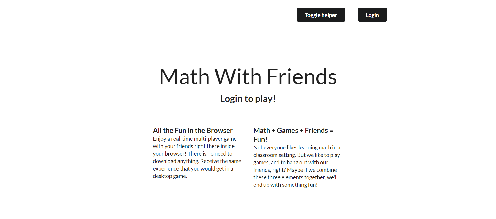
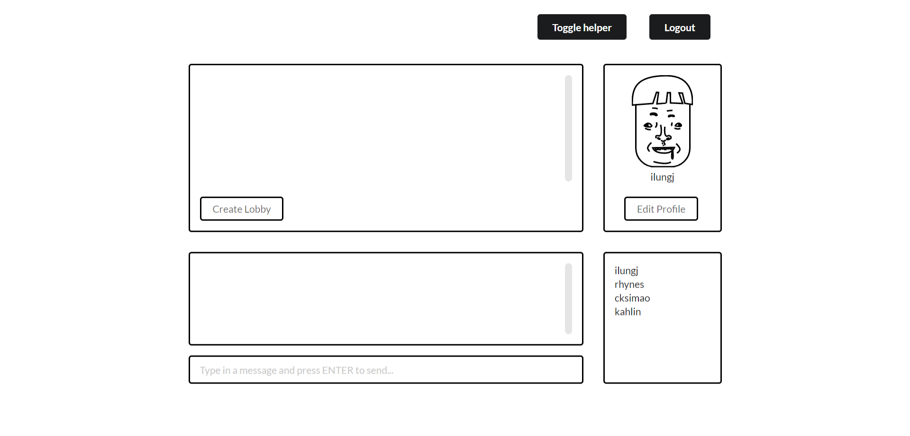
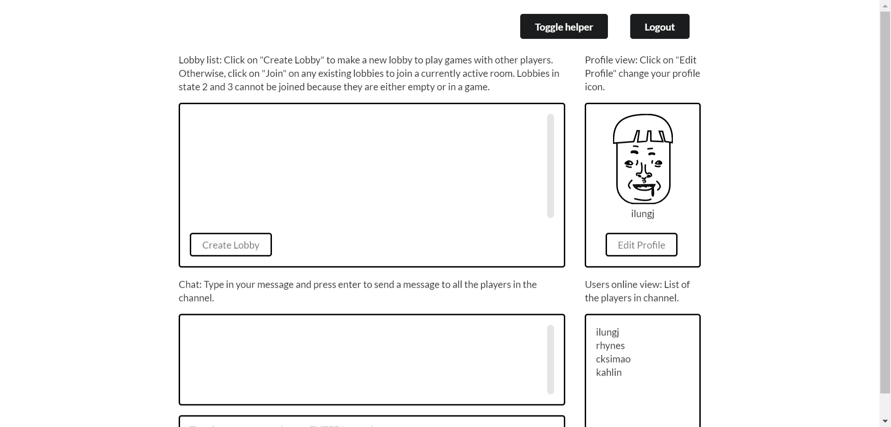
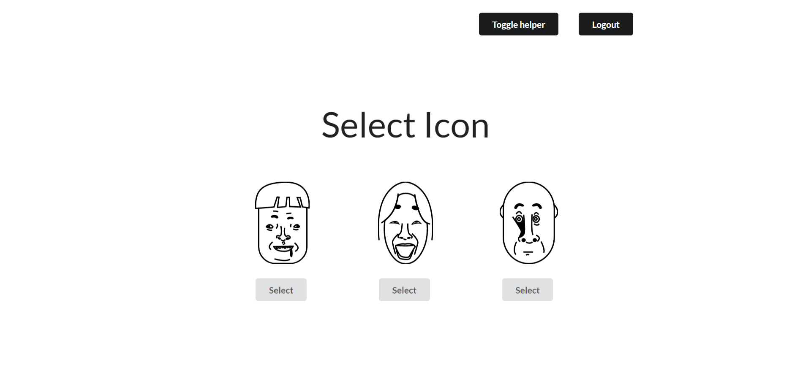
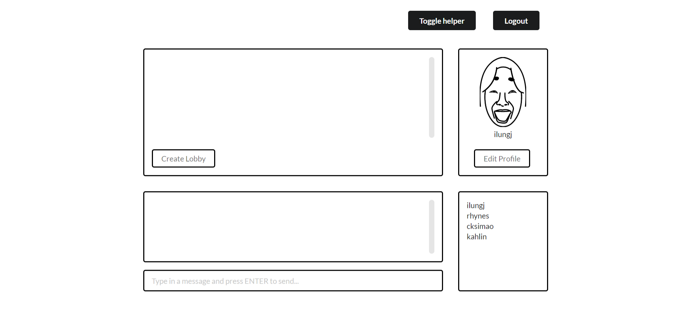
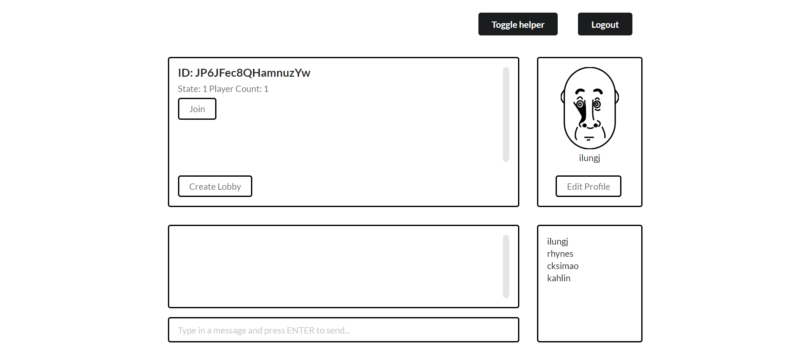
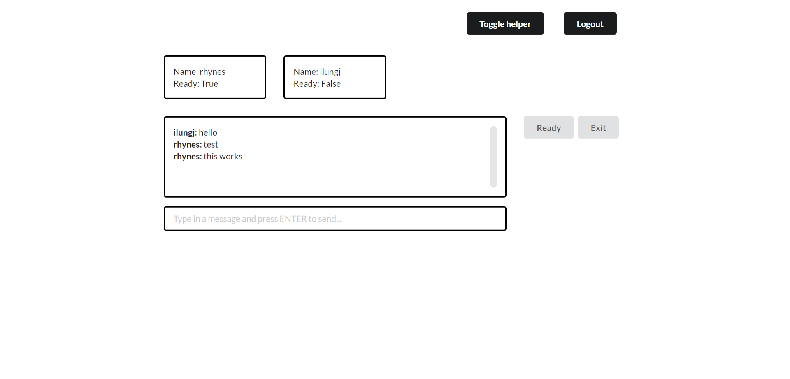
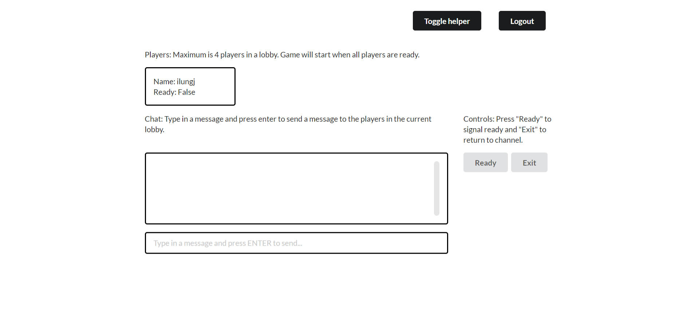
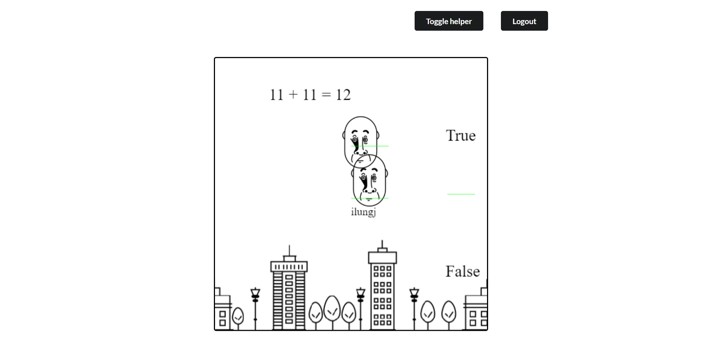

# Table of Contents

* [Overview](#overview)
* [User Guide](#user-guide)
* [Community Feedback](#community-feedback)
* [Development Guide](#development-guide)
* [Development History](#development-history)
* [Contact Us](#contact-us)

# Overview

Math with Friends is an online game that makes learning math fun for students.

For many students at University of Hawaii at Manoa, math is not their most favorite subject in school.
For example, you can hear the students grumbling when you pass by the school's algorithm classes. The intent of
Math with Friends is to motivate these students to enjoy learning math. It aims to give them better
practice at math concepts, motivation, and the insight that even math can be sometimes fun.

The scope of the problems given is restricted to math at the moment for simplicity's sake, but the vision
is that we would extend Math with Friends in the future to encompass a variety of subjects offered in school.
Also, the population of the users should not be limited to students at the University of Hawaii
at Manoa, but eventually include students from many different schools around the state.

Check out the demo of the application [here](http://mathwithfriends.meteorapp.com/).
Check out the current project page [here](https://github.com/math-with-friends/math-with-friends/projects/2).

# User Guide



This is the landing page. Press on the login button to start loading the application.



This is the channel where you can interact with other players that are logged onto the application.
The top left section is where the lobbies that are currently available to join will be listed.
The top right section is your mini profile view. Bottom left is the chat, and bottom right is the users
online view.



If you need help understanding what does what, simply click on the toggle helper button to render
tutorial texts on the screen.



When you click on the "Edit Profile" button, you are redirected to a screen where you can choose your
favorite icon. This icon will represent your appearance in-game.



Notice how your profile icon has now changed.



This is an example of a lobby that you can join. Click on the "Join" button to join the other players
in that lobby. You can also make a brand new lobby by clicking on the "Create lobby" button.



This is the lobby page. Nobody else can see this particular screen unless you are one of the players
joined to that specific lobby. On the top you can see a list of players. Press on the "Ready" button
to indicate that you are ready to play. When ever player has done this, the game will start.
Otherwise, press on the "Exit" button to return to the channel.



If you are lost, you can always toggle helper texts to guide you through the lobby interface as well.



The game starts immediately when you join the game. Press the SPACEBAR on your keyboard to jump.
You can see the movement of the characters of the other players in real-time. The game page also
supports helper texts.

## Main Idea

Players can fly across the map simultaneously, while passing through quiz problems which we will call "checkpoints" for convenience. At each checkpoint, there are two distinct areas on the screen through which the players have to pass, each area indicating "yes" or "no". At the top of the screen, there will be a simple math statement, and the yes or no areas indicate the truth value of the statement. The players have to pass through the correct area, or else they'll lose the game. At the end of the map, there is a finishing line. The goal of this game is to reach the finishing line as quickly as possible, while correctly answering the math questions along the way.


# Community Feedback

We had 5 UH students from different backgrounds (e.g. ICS, Biology, Psychology) test out the application.

Positive impressions:
- Cute pictures.
- UI looks friendly, almost like hand-writing in composition book.
- Has a lot of potential to grow big.
- Seeing characters move in real-time is cool.

Suggestions:
- Make it less laggy.
- One player should not be able to open multiple browsers.
- Need more difficult math problems.
- Mix off-white colors with the current black and white UI design.

# Development Guide

## Installation

First, [install Meteor](https://www.meteor.com/install).

Second, [download a copy of Math With Friends](https://github.com/math-with-friends/math-with-friends/), or clone it using git.
  
Third, cd into the app/ directory and install libraries with:

```
$ meteor npm install
```

Fourth, run the system with:

```
$ meteor run
```

## Directory Structure

```
client/
  lib/           # Holds Semantic UI files.
  head.html      # The <head>.
  main.js        # Import all the client-side html and js files.
  main.less      # Global styling.

imports/
  api/           # Defines data processing code (server side).
    game/
    lobby/
  startup/       # Defines code to run when system starts up (client-only, server-only).
    client/        
    server/        
  ui/
    components/  # Templates that appear inside a page template.
    layouts/     # Layouts contain common elements to all pages (i.e. menubar and footer).
    pages/       # Pages are navigated to by FlowRouter routes.
    stylesheets/ # CSS customizations, if any.

node_modules/    # managed by Meteor

public/          
  images/        # Holds static images for landing page and predefined sample users.
  
server/
   main.js       # Import all the server-side js files.
```

## Separation of Concerns

We believe that drawing a clear line between client side and server side code is important in increasing the maintainability of the code. As a general rule of thumb, most of the server side code will reside in imports/api while most of the client side code will reside in imports/ui. The server processes the data while the client simply renders it. 

## Efficient Real-Time Communication 

An integral component in a multiplayer game is reactivity and the spontaneity of other players' actions. To accomplish this, first we considered a naive approach- if we keep the application data in database collections and publish them, then Meteor's native, reactivity magic will provide the players access to real-time data. The problem with this approach is that we have a constraint. Because our database is hosted on MLAB, the speed at which database queries are made will be limited and using slow responses to accomplish real-time communication will be inefficient.

The way that we handle real-time communication in our application is through a communication channel over DDP provided by rocketchat:streamer. The client sends input or requests via Meteor's built-in RPC method call. The server listens to the requests, processes the data, and broadcasts the result to all clients that are listening to it. There is a huge amount of data traffic, but none of them gets stored in the database unless necessary. This is much faster than the traditional publish and subscribe approach using Meteor collections.

## Rendering of Game

The login, channel, and lobby pages are rendered normally by the browser. For the actual game, however, it is constructed with an open source game engine called Phaser. A wrapper package for Meteor is used in the application (vrakfall:phaser).

## Routing

To replicate the user experience received from a regular desktop game, we disable routing by URL (effectively not utilizing FlowRouter at all). All content will be delivered through the home page. The home page then renders specific content using Template.dynamic. The content to be delivered is dictated by a Session variable, which gets updated reactively.

# Development History

## Milestone 1

As a result of the efforts put into Milestone 1, the following feats were accomplished:

- Implement accounts-password login system for prototyping purposes.

- Create a Game class that will be responsible for updating game states
  and broadcasting it to the clients.

- Create the game page to render player, background, and other entities.
  Clients receiving update from the server are behind some miliseconds
  due to ping. Entities are interpolated from the last two known states.
  
- Create the Lobby class that will supply the data to be rendered by the lobby
  page.
  
- Create the lobby page.

- Create the channel page that lists the lobbies currently created on the server. Players
  can select a particular room, and from there enter the game.

- Create a mock-up of the profile page.

It is worth noting that we overshot our original goal of just creating the mock-up pages. Apart from the profile page, all of the other pages are capable of communicating with their respective data sources and render appropriate data.

## Milestone 2

As a result of the efforts put into Milestone 2, the following were accomplished:

- Implement CAS login.

- Implement reliable ping system to determine when user has disconnected.

- Update lobby page to include chat, users online, profile view and fully functional lobby list component.

- Update channel page to include chat, players list, and controls components.

- Add working game play.

- Improve user interface design.

- Add application tutorial text.

- Implement user-profile page for user selection of icon.

# Contact Us

Il Ung Jeong: ilungj@hawaii.edu
Robert Hynes: rhynes@hawaii.edu
Cameron Simao: cksimao@hawaii.edu
