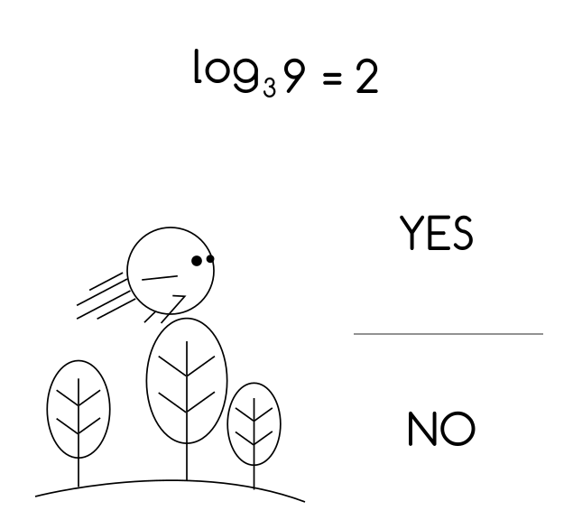
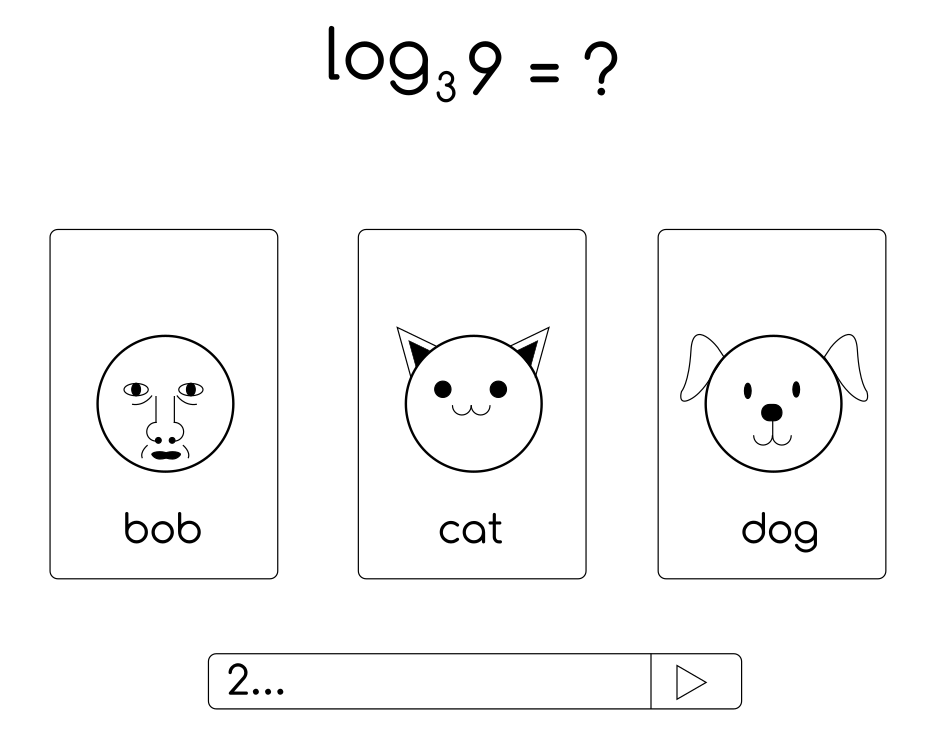

# About Math With Friends

Math With Friends is an online game that makes learning math fun for students.

Rough sketch of what the landing page should look like:

Rough sketch of what the login page should look like:

After login, users arrive at a channel, which is a lobby where the users can see other users that are signed in, make a chat, or join a room to play a match. Rough sketch of what the channel page should look like:

Currently there are two ideas on the table regarding the actual gameplay:

## Main Idea

Users can fly across the map simultaneously, while passing through quiz problems which we will call "checkpoints" for convenience. At each checkpoint, there are two distinct areas on the screen through which the users have to pass, each area indicating "yes" or "no". At the top of the screen, there will be a simple math statement. The yes or no areas indicate the truth value of the math statement. The users have to pass through the correct area, or else they'll lose the game. At the end of the map, there is a finishing line. The goal of this game is to reach the finishing line as quickly as possible, while correctly answering the math questions along the way.

## Backup Idea

Given that there is less than a month to formally work on this project, a backup plan was devised in case that the main idea was too difficult to realize. For this version of the game, users will enter a room and answer math questions by string input in a quiz like manner.

